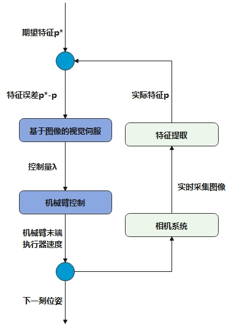

<video width="640" height="480" controls>
  <source src="assets/video.mp4" type="video/mp4">
</video>

---

本代码使用realsense D435i相机，UR5机器人实现基于图像的视觉伺服控制

# 视觉伺服跟踪控制

基于图像点特征的**视觉伺服**利用摄像头捕获的图像信息来引导机器人的动作，实现对目标的精准跟踪与操作。视觉伺服的核心在于识别和跟踪图像中的关键点特征，这些特征通常是图像中变化明显、易于区分的局部区域，如：

- **SIFT（尺度不变特征变换）**
- **SURF（加速稳健特征）**

等算法所提取的特征点。

视觉伺服系统具有以下特点：

- 实时性
- 灵活性
- 对环境变化的适应性

它能够在不断变化的环境中保持对目标的稳定跟踪，从而使得机器人能够在复杂多变的条件下完成任务。

---

## 相机运动与图像特征速度的关系

考虑一个相机在世界坐标系中以刚体速度移动，并观察一个世界坐标系中的空间点 $ P $，该点相对于相机的坐标是 $ \mathbf{p} = [x\ y\ z]^T $。

这个点相对于相机坐标系的运动速度可以写成标量形式：

$$
\dot{x} = -v_x - \omega_y z + \omega_z y \\
\dot{y} = -v_y + \omega_x z - \omega_z x \\
\dot{z} = -v_z - \omega_x y + \omega_y x
$$

对于归一化坐标，透视投影方程为：

$$
u = \frac{x}{z},\quad v = \frac{y}{z}
$$

使用商的求导法则，上式的时间导数为：

$$
\dot{u} = \frac{\dot{x}z - x\dot{z}}{z^2},\quad \dot{v} = \frac{\dot{y}z - y\dot{z}}{z^2}
$$

将 $ \dot{x}, \dot{y}, \dot{z} $ 带入上式，可以把它写成矩阵形式：

$$
\begin{bmatrix}
\dot{u} \\
\dot{v}
\end{bmatrix}
=
\begin{bmatrix}
-\frac{1}{z} & 0 & \frac{x}{z^2} & \frac{xy}{z} & -(1 + \frac{x^2}{z^2}) & \frac{y}{z} \\
0 & -\frac{1}{z} & \frac{y}{z^2} & 1 + \frac{y^2}{z^2} & -\frac{xy}{z} & -\frac{x}{z}
\end{bmatrix}
\begin{bmatrix}
v_x \\
v_y \\
v_z \\
\omega_x \\
\omega_y \\
\omega_z
\end{bmatrix}
$$

---

## 图像坐标与像素坐标的转换关系

归一化图像平面坐标与像素坐标的关系可以用下式表示为：

$$
u = f_x \cdot \frac{x}{z} + c_x,\quad v = f_y \cdot \frac{y}{z} + c_y
$$

其中：

- $ f_x, f_y $：焦距在 x 和 y 方向上的像素值；
- $ c_x, c_y $：主点坐标（图像中心）；

上式的时间导数是：

$$
\dot{u} = f_x \cdot \dot{\left(\frac{x}{z}\right)} = f_x \cdot \left( \frac{\dot{x}z - x\dot{z}}{z^2} \right)
$$

得出：

$$
\begin{bmatrix}
\dot{u} \\
\dot{v}
\end{bmatrix}
= L(p)
\begin{bmatrix}
v_x \\
v_y \\
v_z \\
\omega_x \\
\omega_y \\
\omega_z
\end{bmatrix}
$$

其中，$ L(p) $ 是针对一个特征点的 **2×6 图像雅可比矩阵**。

---

## 多特征点的控制策略

对于三个点 $ p_1, p_2, p_3 $ 的情况，相应的速度为 $ \dot{u}_1, \dot{v}_1, \dot{u}_2, \dot{v}_2, \dot{u}_3, \dot{v}_3 $，则对上式方程求逆：

$$
\begin{bmatrix}
v_x \\
v_y \\
v_z \\
\omega_x \\
\omega_y \\
\omega_z
\end{bmatrix}
= L^\dagger(p)
\begin{bmatrix}
\dot{u}_1 \\
\dot{v}_1 \\
\dot{u}_2 \\
\dot{v}_2 \\
\dot{u}_3 \\
\dot{v}_3
\end{bmatrix}
$$

得出所需的相机速度。使用一个线性控制器：

$$
\dot{u}_i = -k (u_i - u_i^*),\quad \dot{v}_i = -k (v_i - v_i^*)
$$

它将驱动特征点朝它们在图像平面上的期望值 $ (u_i^*, v_i^*) $ 运行。

联立得：

$$
\mathbf{v}_{\text{camera}} = -k \cdot L^\dagger(p) (\mathbf{p} - \mathbf{p}^*)
$$

至此我们可以得到 $ \mathbf{v}_{\text{camera}} $，即**基于图像的视觉伺服中相机在其自身坐标系中的速度表达式**，将其乘以机械臂雅可比矩阵即可得到各个关节的速度。

---

## 视觉伺服流程图（闭环控制系统）

如图所示，视觉伺服的总流程是一个闭环控制系统，涉及多个相互关联的步骤：

1. **图像采集模块**：负责获取目标物体的实时图像；
2. **特征检测与描述阶段**：
   - 使用特定的算法从图像中提取出稳定的特征点；
   - 为这些点生成描述符，以便在连续的图像帧中进行匹配；
3. **运动估计与控制阶段**：
   - 根据特征匹配结果计算目标的位置偏差；
   - 生成相应的控制命令调整机械臂的运动；
4. **反馈阶段**：
   - 根据相机实时采集图像不断生成连续的控制命令，形成闭环控制。

整个流程中，**特征的选取、计算效率的提升以及系统鲁棒性的增强**，是提高视觉伺服性能的关键所在。

  